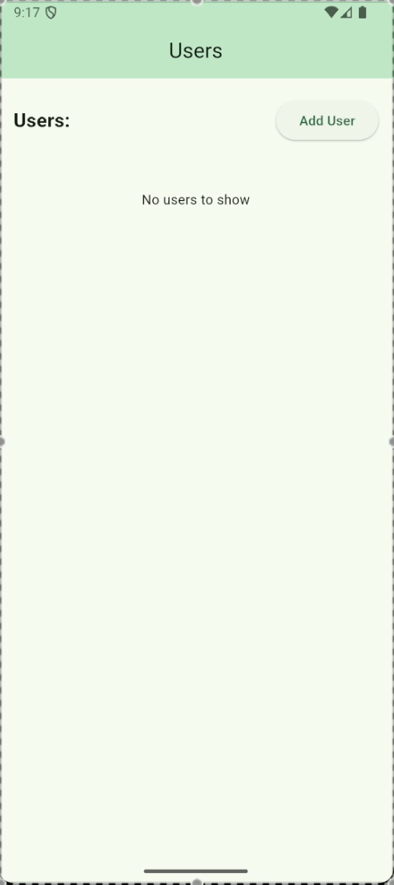

# CRUD User Assignment

A Flutter application demonstrating clean architecture principles, BLoC state management, and CRUD operations to create a user management system.

 

## Architecture

The project follows a **clean architecture** approach with clear separation of concerns:

- **Data Layer**: Handles local storage operations (CRUD) using Hive as the data source.  
- **Domain Layer**: Contains use cases that define application-specific business logic.  
- **Presentation Layer**: UI screens and widgets interact with the app state via **BLoC**.  
- **BLoC**: Manages state and business logic using `BlocBuilder` and `BlocListener`, keeping UI reactive and stateless.

## Features

1. **State Management**  
   - BLoC pattern ensures separation of UI and business logic.  
   - UI listens to state changes and reacts accordingly.

2. **CRUD Operations**  
   - Users can be created, read, updated, and deleted.  
   - All operations go through domain use cases.

3. **Screens**  
   - **User Screen**: Displays a list of users with options to add new user, view details or delete.  
   - **User Details Screen**: Shows detailed information for a selected user and allows updating or deleting the user.

4. **Navigation**  
   - Uses a clean navigation system with proper route management.  
   - Ensures smooth UX between user list and user details screens.

## Notes

   - `.env` file is **gitignored**, so sensitive configurations are not included in the repository.  
   - Hive DB name is currently hardcoded with comment in the `RemoteUsersDataSource` for testing purposes. Normally, storing DB names directly in the code is not recommended.

## Setup Instructions

1. **Clone the repository**:
   ```bash
   git clone https://github.com/SamiaAshraff/user_management.git
   cd pcfc_assignment
   git checkout main

   flutter pub get
   flutter pub run build_runner build --delete-conflicting-outputs
   flutter run


